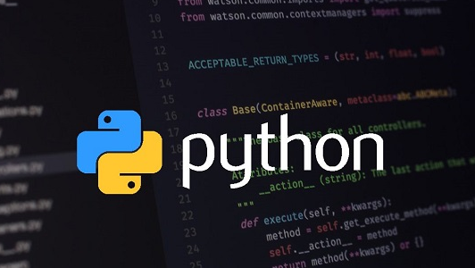

## Python_Practice1
A Repo created for sharing, collaborating, and practicing Python Programming Language.

### Intro
Python is a high-level, general-purpose and a very popular programming language. Python programming language (latest Python 3) is being used in web development, Machine Learning applications, along with all cutting edge technology in Software Industry. Python Programming Language is very well suited for Beginners, also for experienced programmers with other programming languages like C++ and Java.

### Facts about Python
- Python is currently the most widely used multi-purpose, high-level programming language.
- Python allows programming in Object-Oriented and Procedural paradigms.
- Python programs generally are smaller than other programming languages like Java. Programmers have to type relatively less and indentation requirement of the language, makes them readable all the time.
- Python language is being used by almost all tech-giant companies like – Google, Amazon, Facebook, Instagram, Dropbox, Uber… etc.
  - The biggest strength of Python is huge collection of standard library which can be used for the following:
    - Machine Learning
    - GUI Applications (like Kivy, Tkinter, PyQt etc. )
    Web frameworks like Django (used by YouTube, Instagram, Dropbox)
    - Image processing (like OpenCV, Pillow)
    - Web scraping (like Scrapy, BeautifulSoup, Selenium)
    - Test frameworks
    - Multimedia
    - Scientific computing
    - Text processing and many more..

### Language Features
- Interpreted
  - There are no separate compilation and execution steps like C and C++.
  - Directly run the program from the source code.
  - Internally, Python converts the source code into an intermediate form called bytecodes which is then translated into native language of specific computer to run it.
  - No need to worry about linking and loading with libraries, etc.
- Platform Independent
  - Python programs can be developed and executed on multiple operating system platforms.
  - Python can be used on Linux, Windows, Macintosh, Solaris and many more.
- Free and Open Source, Redistributable
- High-level Language
  - In Python, no need to take care about low-level details such as managing the memory used by the program.
  - Simple
  - Closer to English language;Easy to Learn
  - More emphasis on the solution to the problem rather than the syntax
- Embeddable
  - Python can be used within C/C++ program to give scripting capabilities for the program’s users.
  - Robust
  - Exceptional handling features
  - Memory management techniques in built
  - Rich Library Support
  - The Python Standard Library is very vast.
  - Known as the “batteries included” philosophy of Python ;It can help do various things involving regular expressions, documentation generation, unit testing, threading, databases, web browsers, CGI, email, XML, HTML, WAV files, cryptography, GUI and many more.
- Besides the standard library, there are various other high-quality libraries such as the Python Imaging Library which is an amazingly simple image manipulation library.

### Softwares making use of Python

Python has been successfully embedded in a number of software products as a scripting language.

    GNU Debugger uses Python as a pretty printer to show complex structures such as C++ containers.
    Python has also been used in artificial intelligence
    Python is often used for natural language processing tasks.

### Current Applications of Python

    A number of Linux distributions use installers written in Python example in Ubuntu we have the Ubiquity
    Python has seen extensive use in the information security industry, including in exploit development.
    Raspberry Pi– single board computer uses Python as its principal user-programming language.
    Python is now being used Game Development areas also.

### Pros:

    Ease of use
    Multi-paradigm Approach

### Cons:

    Slow speed of execution compared to C,C++
    Absence from mobile computing and browsers
    For the C,C++ programmers switching to python can be irritating as the language requires proper indentation of code. Certain variable names commonly used like sum are functions in python. So C, C++ programmers have to look out for these.

### Industrial Importance
- Most of the companies are now looking for candidates who know about Python Programming. Those having the knowledge of python may have more chances of impressing the interviewing panel. So I would suggest that beginners should start learning python and excel in it.
- Python is a high-level, interpreted, and general-purpose dynamic programming language that focuses on code readability. It has fewer steps when compared to Java and C. It was founded in 1991 by developer Guido Van Rossum. Python ranks among the most popular and fastest-growing languages in the world. Python is a powerful, flexible, and easy-to-use language. In addition, the community is very active there. It is used in many organizations as it supports multiple programming paradigms. It also performs automatic memory management.